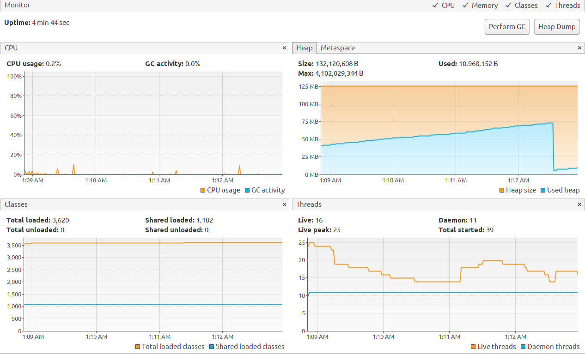
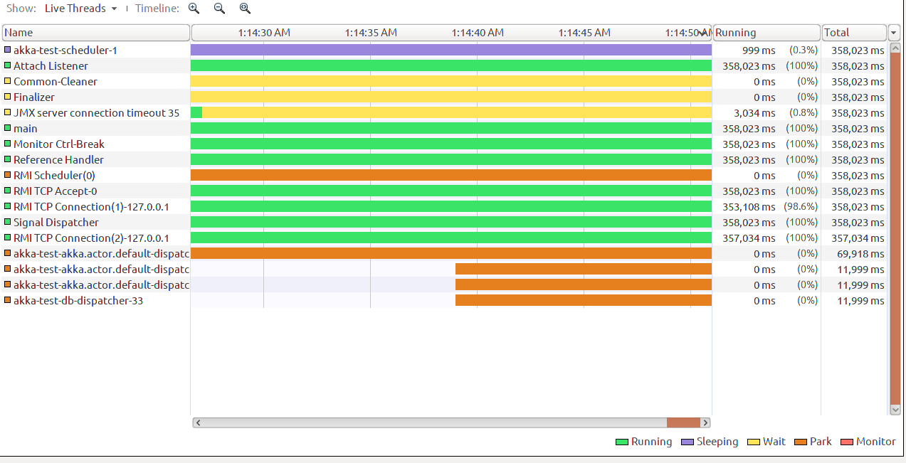
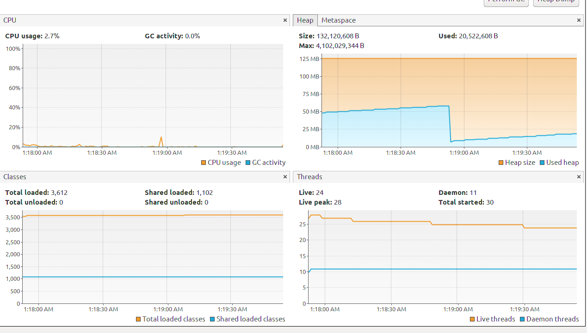
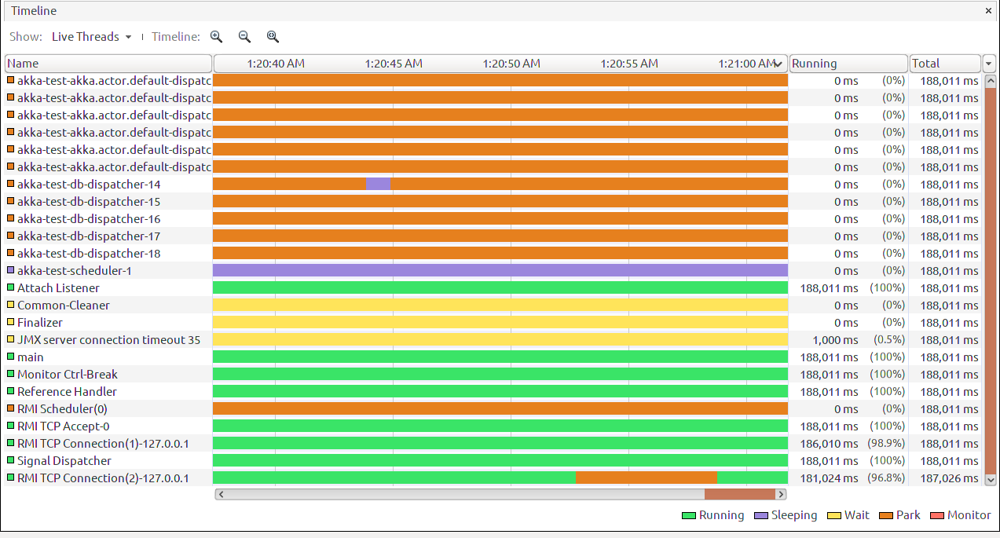
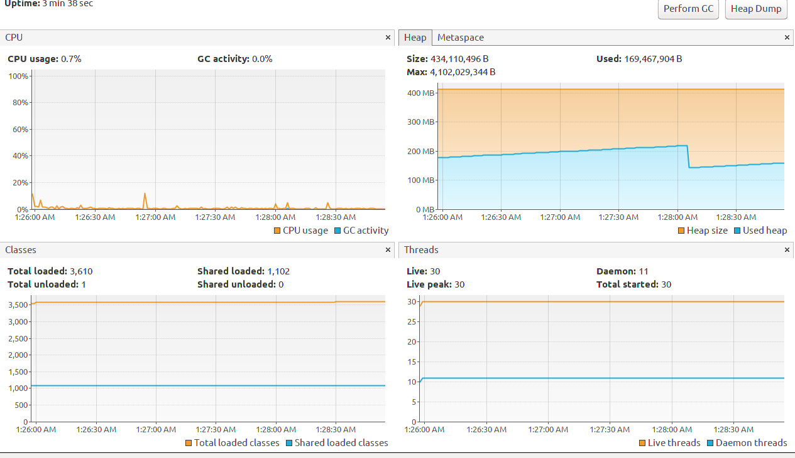
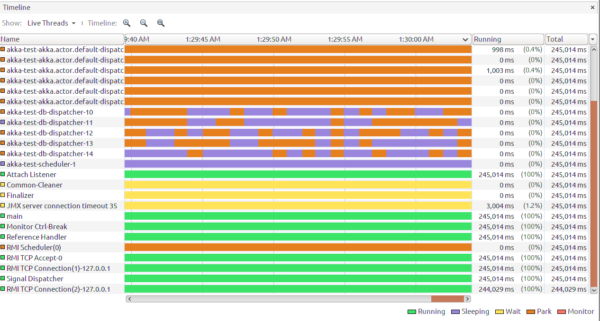

# Akka to many timer

Finding resource usage of akka framework
when there are too many timers on system

## program
Assuming that we have to many jobs thats wants to be executed in different times.

The job Logic actor is trying to simulate the job role


## Test Env
* Akka version: 2.5.21
* Java: openjdk version "11.0.1"

# Result

## Run With 2 job

```
app {
  worker-count = 5
  job-count = 2
}
```

The App Take 75Mb of heap before GC and 1% of cpu


I don't know why heap usage are **increasing** !

The program starts new thread called scheduler and its sleeping.


## Run With 100 job

```
app {
  worker-count = 5
  job-count = 100
}
```

The App Take 75Mb of heap before GC and 1% of cpu





## Run With 1,000 job

```
app {
  worker-count = 5
  job-count = 1000
}
```
Jobs run with 11ms Delay, **Cool** !

The App Take 75Mb of heap before GC and 1% of cpu






## Run With 100,000 job

```
app {
  worker-count = 5
  job-count = 100000
}
```

Jobs run with 15ms Delay, **So Cool** !





